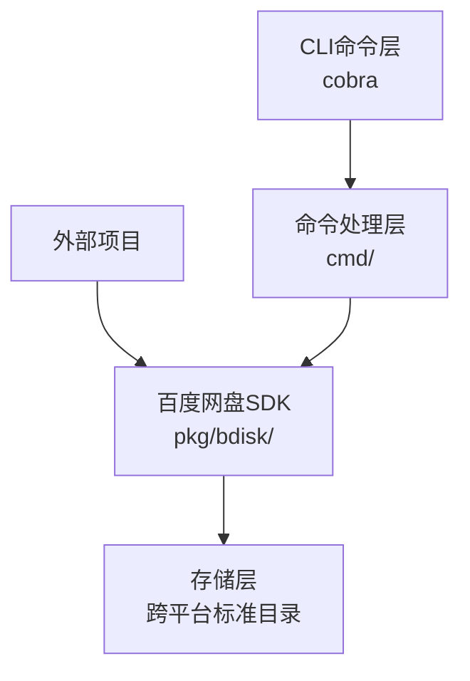
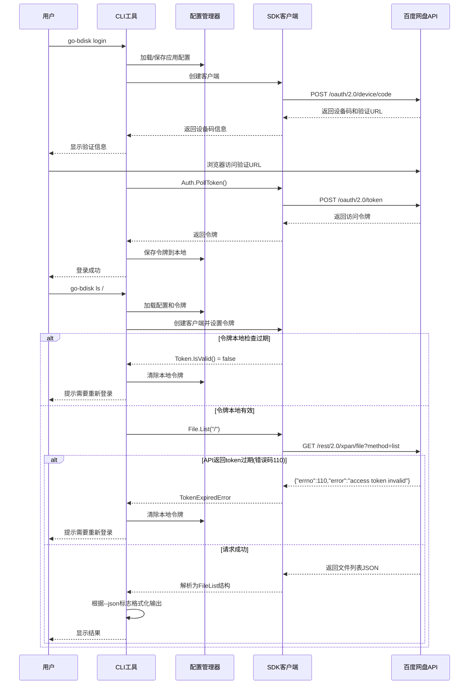

# 百度网盘CLI工具架构设计

## 项目概述
项目包名：github.com/baowuhe/go-bdisk

使用Go语言开发的百度网盘CLI工具，同时提供可独立使用的SDK包。支持设备码授权、文件管理等功能。

## 系统架构



## 项目结构

```
go-bdisk/
├── cmd/                    # 命令行入口
│   ├── root.go            # 根命令
│   ├── login.go           # 登录命令
│   ├── logout.go          # 登出命令
│   ├── auth_check.go      # 认证状态检查
│   ├── info.go            # 信息查询命令
│   ├── ls.go              # 列出文件命令
│   ├── stat.go            # 文件信息查询
│   ├── mv.go              # 移动文件命令
│   ├── cp.go              # 复制文件命令
│   ├── rename.go          # 重命名文件
│   ├── mkdir.go           # 创建目录
│   ├── rm.go              # 删除文件/目录
│   ├── download.go        # 下载命令
│   └── upload.go          # 上传命令
├── pkg/
│   ├── API.md             # API文档
│   └── bdisk/             # 百度网盘SDK（可独立导入）
│       ├── doc.go         # 包文档入口
│       ├── client.go      # SDK主客户端
│       ├── auth.go        # 授权相关
│       ├── user.go        # 用户信息
│       ├── file.go        # 文件操作
│       ├── download.go    # 下载
│       ├── upload.go      # 上传
│       ├── api.go         # API请求封装
│       ├── config.go      # SDK配置
│       ├── errors.go      # 错误定义
│       └── model/         # 数据模型
│           ├── user.go
│           ├── file.go
│           └── quota.go
├── internal/
│   ├── config/            # CLI配置管理
│   │   ├── config.go      # 配置读写
│   │   └── token.go       # 令牌持久化
│   └── cliutil/           # CLI工具函数
│       └── output.go      # 输出格式化
├── plans/
│   └── architecture.md    # 架构设计文档
├── go.mod
├── go.sum
├── main.go
└── README.md
```

## 核心模块设计

### 1. 百度网盘SDK (pkg/bdisk)
设计为可独立使用的包，外部项目可通过 `go get` 导入使用：
```go
import "github.com/baowuhe/go-bdisk/pkg/bdisk"
```

#### SDK主要功能：
- `bdisk.NewClient()` - 创建SDK客户端
- `bdisk.NewConfig()` - 创建SDK配置
- `Auth.DeviceCodeFlow()` - 设备码授权流程
- `Auth.PollToken()` - 轮询获取访问令牌
- `Auth.IsTokenValid()` / `Token.IsValid()` - 检查令牌有效性
- `Auth.ClearToken()` / `Client.ClearToken()` - 清除过期令牌
- `Client.SetToken()` - 设置访问令牌
- `User.GetInfo()` - 获取用户信息
- `User.GetQuota()` - 获取网盘配额信息
- `File.List()` - 列出文件/目录
- `File.Move()` - 移动文件/目录
- `File.Copy()` - 复制文件/目录
- `File.Rename()` - 重命名文件/目录
- `File.Delete()` - 删除文件/目录
- `File.Mkdir()` - 创建目录
- `File.Stat()` - 获取文件信息
- `Download.Start()` - 下载文件
- `Upload.Start()` - 上传文件
- `bdisk.IsTokenExpiredError()` - 检查是否为token过期错误
- 统一的错误处理机制，包含HTTP错误、API错误和token过期错误

#### SDK文档规范
所有公开的API都遵循Go标准文档规范，通过`go doc`和pkg.go.dev可直接查看：

**文档组织方式：**
1. **包级别文档** ([`doc.go`](pkg/bdisk/doc.go))
   - 包的概述和功能说明
   - 快速开始示例代码
   - 安装和导入说明

2. **类型和函数文档**
   - 每个公开类型都有详细的功能描述
   - 每个方法都包含参数说明、返回值说明和使用示例
   - 错误情况说明

3. **示例代码**
   - 在包级文档中提供完整的使用示例
   - 关键功能配有可运行的示例代码
   - 涵盖常见使用场景

**文档生成：**
- 使用Go原生的文档注释格式
- 支持`godoc`本地查看：`godoc -http=:6060`
- 自动发布到pkg.go.dev（通过Go module）
- README.md中包含指向在线文档的链接

**文档内容包括：**
- 认证流程说明
- API调用示例
- 错误处理指南
- Token过期处理说明
- 完整的功能列表

### 2. CLI配置模块 (internal/config)
- 管理应用ID和密钥
- 令牌持久化到本地
- 跨平台标准缓存目录支持：
  - Windows: `%LOCALAPPDATA%\go-bdisk\`
  - macOS: `~/Library/Application Support/go-bdisk/`
  - Linux: `~/.config/go-bdisk/` 或 `$XDG_CONFIG_HOME/go-bdisk/`
- 配置文件位置：`[缓存目录]/config.yaml`
- 令牌缓存位置：`[缓存目录]/token.json`

### 3. 命令行模块 (cmd/)
- 使用Cobra框架
- 封装SDK功能为CLI命令
- 参数解析和验证
- 支持两种输出格式：
  - 人类可读模式（默认）：简洁友好的文本输出
  - 机器可读模式（--json）：结构化JSON输出
- 全局标志：--json / -j 切换输出格式

## CLI输出格式设计

### 人类可读模式（默认）
简洁友好的文本输出，适合终端用户阅读：

```bash
$ go-bdisk ls /
路径: /
文件总数: 5

[文件夹]  文档      2024-01-15 10:30
[文件夹]  图片      2024-01-10 08:45
[文件]    notes.txt 2 KB   2024-01-20 15:22
```

### 机器可读模式（--json / -j）
结构化JSON输出，适合程序解析：

```bash
$ go-bdisk ls / --json
{
  "success": true,
  "data": {
    "path": "/",
    "items": [
      {
        "type": "dir",
        "name": "文档",
        "path": "/文档",
        "modified_at": "2024-01-15T10:30:00Z"
      },
      {
        "type": "file",
        "name": "notes.txt",
        "path": "/notes.txt",
        "size": 2048,
        "modified_at": "2024-01-20T15:22:00Z"
      }
    ]
  }
}
```

### 统一JSON响应结构
```go
type JSONResponse struct {
    Success bool        `json:"success"`
    Data    interface{} `json:"data,omitempty"`
    Error   string      `json:"error,omitempty"`
}
```

### CLI输出工具函数
CLI命令通过 `internal/cliutil` 包中的工具函数实现统一的输出格式：

```go
// PrintOutput 根据outputJSON标志输出内容
func PrintOutput(outputJSON bool, data interface{}, humanReadable func())

// PrintError 输出错误
func PrintError(outputJSON bool, err error)

// FormatSize 格式化文件大小
func FormatSize(size int64) string
```

所有CLI命令都使用这些函数来确保输出格式的一致性。当 `--json` 标志被设置时，命令输出结构化的JSON响应；否则输出人类可读的文本格式。

## API调用流程

### CLI命令初始化流程
每个CLI命令在执行时都会调用 `initClient()` 函数，该函数负责：
1. 加载配置管理器 (`config.NewManager()`)
2. 读取应用配置和令牌
3. 创建SDK客户端 (`bdisk.NewClient()`)
4. 设置令牌到客户端
5. 返回客户端、配置管理器和错误处理

### 完整API调用序列



### 关键实现细节
1. **配置管理**：`internal/config` 包负责跨平台的配置和令牌持久化
2. **客户端初始化**：所有命令共享 `initClient()` 函数确保一致的初始化逻辑
3. **错误处理**：统一的错误处理机制，通过 `cliutil.PrintError()` 输出
4. **令牌管理**：SDK和CLI层都提供令牌检查和管理功能

## Token过期处理机制

### Token数据结构
```go
type Token struct {
    AccessToken  string `json:"access_token"`   // 访问令牌
    RefreshToken string `json:"refresh_token"`  // 刷新令牌
    ExpiresIn    int64  `json:"expires_in"`     // 有效期（秒）
    CreatedAt    int64  `json:"created_at"`     // 创建时间戳（Unix时间戳）
    ExpiresAt    time.Time `json:"-"`           // 过期时间（运行时计算）
}

// IsValid 检查token是否有效
func (t *Token) IsValid() bool

// IsExpired 检查token是否已过期
func (t *Token) IsExpired() bool
```

### Token生命周期管理
1. **令牌获取**：通过设备码授权流程获取access token和refresh token
2. **本地存储**：令牌与创建时间戳一起保存到 `token.json` 文件
3. **过期计算**：根据 `CreatedAt` 和 `ExpiresIn` 计算实际过期时间
4. **自动检测**：`Token.IsValid()` 方法在每次使用前检查令牌状态

### 双重过期检测策略
1. **本地预检查**：在发起API请求前，通过 `Token.IsValid()` 检查本地存储的过期时间
2. **API响应验证**：即使本地检查通过，仍需处理API返回的token失效错误（错误码110）
3. **错误类型识别**：`bdisk.IsTokenExpiredError(err)` 函数用于识别token过期错误

### 错误处理流程
1. **本地检测过期**：
   - `Token.IsValid()` 返回 `false`
   - SDK不发起API请求
   - CLI层直接提示用户重新登录

2. **API返回过期错误**：
   - API返回错误码110
   - SDK包装为 `TokenExpiredError`
   - CLI层捕获错误并调用清除令牌流程

3. **清除令牌流程**：
   ```go
   // SDK层清除令牌
   client.Auth.ClearToken()
   client.ClearToken()
   
   // CLI配置层清除令牌
   cfgManager.ClearToken()
   ```

4. **用户提示**：
   - 输出友好的错误信息："登录已过期，请重新登录"
   - 建议用户使用 `go-bdisk login` 重新授权

### 错误码说明
- **百度网盘API错误码110**：access token失效或过期
- **SDK错误类型**：`TokenExpiredError` - 包装了API错误码110的特定错误类型
- **错误检测函数**：`bdisk.IsTokenExpiredError(err)` - 检查错误是否为token过期错误

### 外部SDK使用建议
外部项目使用该SDK时，应遵循以下模式处理token过期：
```go
client, err := bdisk.NewClient(config)
if err != nil {
    // 处理初始化错误
}

// 执行操作
result, err := client.File.List("/")
if err != nil {
    if bdisk.IsTokenExpiredError(err) {
        // 清除本地令牌缓存
        client.Auth.ClearToken()
        // 引导用户重新授权
        return fmt.Errorf("token expired, please re-authenticate")
    }
    // 处理其他错误
}
```

## 主要功能点

### 1. 认证与授权管理
- **设备码授权流程**：完整的OAuth 2.0设备码授权实现
- **登录命令** (`go-bdisk login`)：交互式登录流程
- **登出命令** (`go-bdisk logout`)：清除本地令牌
- **认证检查** (`go-bdisk auth-check`)：验证当前认证状态
- **令牌持久化**：跨平台令牌存储和自动加载

### 2. 用户与网盘信息查询
- **用户信息** (`go-bdisk info`)：获取百度账号和网盘用户信息
- **配额查询**：获取网盘总容量、已使用空间和剩余空间
- **认证状态检查**：验证当前令牌有效性

### 3. 文件与目录操作
- **列出文件** (`go-bdisk ls`)：列出指定路径下的文件和目录
- **文件信息** (`go-bdisk stat`)：获取文件/目录的详细信息
- **创建目录** (`go-bdisk mkdir`)：创建新目录
- **重命名文件** (`go-bdisk rename`)：重命名文件或目录
- **移动文件** (`go-bdisk mv`)：移动文件或目录
- **复制文件** (`go-bdisk cp`)：复制文件或目录
- **删除文件** (`go-bdisk rm`)：删除文件或目录

### 4. 文件传输功能
- **下载文件** (`go-bdisk download`)：下载文件到本地，支持大文件下载
- **上传文件** (`go-bdisk upload`)：上传本地文件到网盘，支持分片上传

### 5. 输出格式与用户体验
- **双模式输出**：人类可读文本格式和结构化JSON格式
- **全局JSON标志** (`--json` / `-j`)：统一切换到JSON输出模式
- **友好错误提示**：清晰的错误信息和解决建议
- **文件大小格式化**：自动格式化文件大小（B, KB, MB, GB等）

### 6. SDK独立使用能力
- **独立导入**：外部项目可通过 `go get github.com/baowuhe/go-bdisk/pkg/bdisk` 导入使用
- **完整API封装**：封装百度网盘OpenAPI的所有核心功能
- **错误处理**：统一的错误类型和错误检查函数
- **文档完整**：符合Go文档标准的完整API文档

### 7. 配置与令牌管理
- **跨平台配置**：支持Windows、macOS、Linux的标准化配置目录
- **安全存储**：应用密钥和访问令牌的安全本地存储
- **自动加载**：CLI工具自动加载配置和令牌
- **令牌过期处理**：自动检测和处理令牌过期情况

### 8. 开发与维护特性
- **模块化设计**：清晰的模块边界和职责分离
- **易于扩展**：可轻松添加新的API功能和CLI命令
- **测试友好**：模块化的设计便于单元测试和集成测试
- **文档完整**：架构文档、API文档和用户指南
