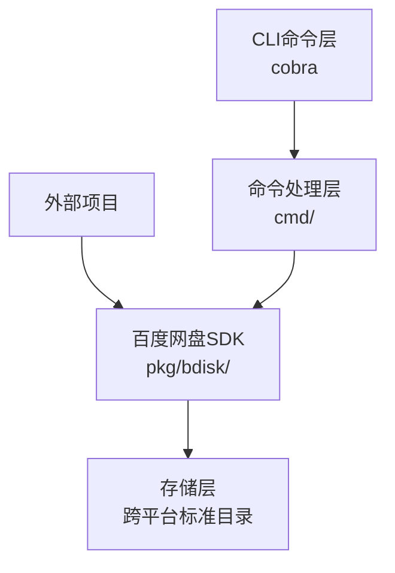
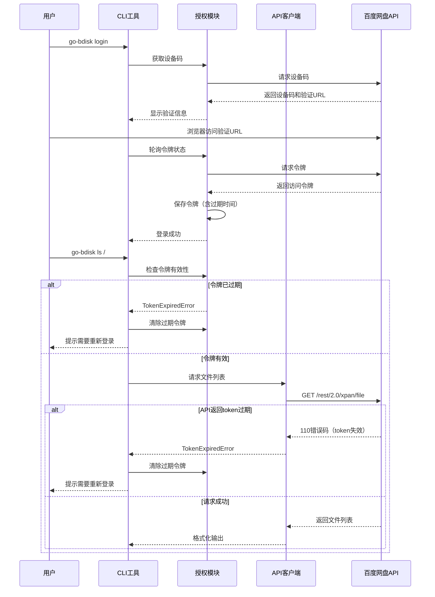

# 百度网盘CLI工具架构设计

## 项目概述
项目包名：github.com/baowuhe/go-bdisk

使用Go语言开发的百度网盘CLI工具，同时提供可独立使用的SDK包。支持设备码授权、文件管理等功能。

## 系统架构



## 项目结构

```
go-bdisk/
├── cmd/                    # 命令行入口
│   ├── root.go            # 根命令
│   ├── login.go           # 登录命令
│   ├── info.go            # 信息查询命令
│   ├── ls.go              # 列出文件命令
│   ├── mv.go              # 移动文件命令
│   ├── cp.go              # 复制文件命令
│   ├── download.go        # 下载命令
│   └── upload.go          # 上传命令
├── pkg/
│   └── bdisk/             # 百度网盘SDK（可独立导入）
│       ├── doc.go         # 包文档入口
│       ├── client.go      # SDK主客户端
│       ├── auth.go        # 授权相关
│       ├── user.go        # 用户信息
│       ├── file.go        # 文件操作
│       ├── download.go    # 下载
│       ├── upload.go      # 上传
│       ├── model/         # 数据模型
│       │   ├── user.go
│       │   ├── file.go
│       │   └── quota.go
│       ├── config.go      # SDK配置
│       └── errors.go      # 错误定义
├── internal/
│   ├── config/            # CLI配置管理
│   │   ├── config.go      # 配置读写
│   │   └── token.go       # 令牌持久化
│   └── cliutil/           # CLI工具函数
├── go.mod
├── go.sum
└── README.md
```

## 核心模块设计

### 1. 百度网盘SDK (pkg/bdisk)
设计为可独立使用的包，外部项目可通过 `go get` 导入使用：
```go
import "github.com/baowuhe/go-bdisk/pkg/bdisk"
```

#### SDK主要功能：
- `bdisk.NewClient()` - 创建SDK客户端
- `Auth.DeviceCodeFlow()` - 设备码授权流程
- `Auth.IsTokenValid()` - 检查令牌有效性
- `Auth.ClearToken()` - 清除过期令牌
- `User.GetInfo()` - 获取用户信息
- `File.List()` - 列出文件
- `File.Move()` - 移动文件
- `File.Copy()` - 复制文件
- `Download.Start()` - 下载文件
- `Upload.Start()` - 上传文件
- 统一错误处理：当API返回token过期错误时，SDK会抛出特定错误类型

#### SDK文档规范
所有公开的API都遵循Go标准文档规范，通过`go doc`和pkg.go.dev可直接查看：

**文档组织方式：**
1. **包级别文档** ([`doc.go`](pkg/bdisk/doc.go))
   - 包的概述和功能说明
   - 快速开始示例代码
   - 安装和导入说明

2. **类型和函数文档**
   - 每个公开类型都有详细的功能描述
   - 每个方法都包含参数说明、返回值说明和使用示例
   - 错误情况说明

3. **示例代码**
   - 在包级文档中提供完整的使用示例
   - 关键功能配有可运行的示例代码
   - 涵盖常见使用场景

**文档生成：**
- 使用Go原生的文档注释格式
- 支持`godoc`本地查看：`godoc -http=:6060`
- 自动发布到pkg.go.dev（通过Go module）
- README.md中包含指向在线文档的链接

**文档内容包括：**
- 认证流程说明
- API调用示例
- 错误处理指南
- Token过期处理说明
- 完整的功能列表

### 2. CLI配置模块 (internal/config)
- 管理应用ID和密钥
- 令牌持久化到本地
- 跨平台标准缓存目录支持：
  - Windows: `%LOCALAPPDATA%\go-bdisk\`
  - macOS: `~/Library/Application Support/go-bdisk/`
  - Linux: `~/.config/go-bdisk/` 或 `$XDG_CONFIG_HOME/go-bdisk/`
- 配置文件位置：`[缓存目录]/config.yaml`
- 令牌缓存位置：`[缓存目录]/token.json`

### 3. 命令行模块 (cmd/)
- 使用Cobra框架
- 封装SDK功能为CLI命令
- 参数解析和验证
- 支持两种输出格式：
  - 人类可读模式（默认）：简洁友好的文本输出
  - 机器可读模式（--json）：结构化JSON输出
- 全局标志：--json / -j 切换输出格式

## CLI输出格式设计

### 人类可读模式（默认）
简洁友好的文本输出，适合终端用户阅读：

```bash
$ go-bdisk ls /
路径: /
文件总数: 5

[文件夹]  文档      2024-01-15 10:30
[文件夹]  图片      2024-01-10 08:45
[文件]    notes.txt 2 KB   2024-01-20 15:22
```

### 机器可读模式（--json / -j）
结构化JSON输出，适合程序解析：

```bash
$ go-bdisk ls / --json
{
  "success": true,
  "data": {
    "path": "/",
    "items": [
      {
        "type": "dir",
        "name": "文档",
        "path": "/文档",
        "modified_at": "2024-01-15T10:30:00Z"
      },
      {
        "type": "file",
        "name": "notes.txt",
        "path": "/notes.txt",
        "size": 2048,
        "modified_at": "2024-01-20T15:22:00Z"
      }
    ]
  }
}
```

### 统一JSON响应结构
```go
type JSONResponse struct {
    Success bool        `json:"success"`
    Data    interface{} `json:"data,omitempty"`
    Error   string      `json:"error,omitempty"`
}
```

## API调用流程



## Token过期处理机制

### Token生命周期
- 百度网盘的access token具有固定的有效期
- SDK在保存token时同时记录过期时间戳
- 过期时间信息存储在token.json文件中

### 过期检测策略
1. **本地预检查**：在发起API请求前，首先检查本地存储的过期时间
2. **API响应验证**：即使本地检查通过，仍需处理API返回的token失效错误（错误码110）

### 错误处理流程
1. 当检测到token过期时，SDK抛出`TokenExpiredError`错误类型
2. CLI层捕获该错误后：
   - 调用`Auth.ClearToken()`清除本地缓存的过期token
   - 向用户输出友好的提示信息
   - 建议用户使用`go-bdisk login`重新登录
3. 外部项目使用SDK时，需自行处理`TokenExpiredError`并引导用户重新授权

### 错误码说明
- 百度网盘API错误码110表示access token失效或过期

## 主要功能点

1. **认证流程**：设备码授权 + 令牌自动刷新
2. **文件操作**：列表、移动、复制、查看信息
3. **下载功能**：支持大文件下载
4. **上传功能**：分片上传
5. **信息查询**：用户信息、网盘配额
